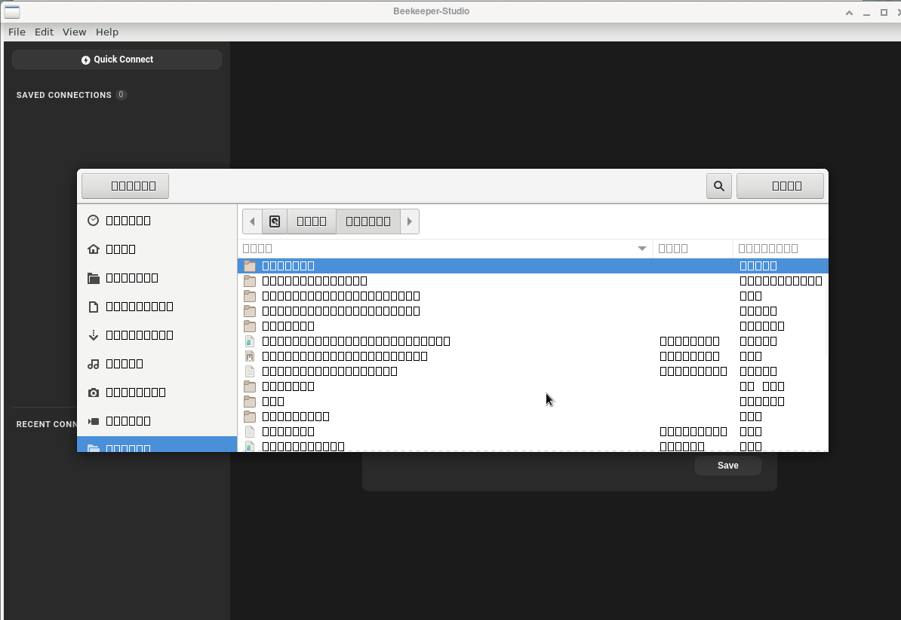

Hopefully you can solve your problems with the details below. If not please  [Contact Support](./contact-support.md) and we'll try our best to help.


## Don't be shy, say hi!

Feel free to file an issue or start a discussion, even if you're not sure if something is wrong. We're a super nice community, and we all help each other out.

- [File an issue](https://github.com/beekeeper-studio/beekeeper-studio/issues/new/choose)
- [Start a discussion](https://github.com/beekeeper-studio/beekeeper-studio/discussions/new)


## Tools for taking screen recordings when reporting issues.

Screen recordings are SUPER helpful when a problem is hard for me to replicate.

Here are the tooks I recommend for taking quick and easy screen captures as GIF or MKV files:

1. MacOS: [Kap](https://getkap.co/) - it's fully open source. It works great. I use this.
2. Linux: [Peek](https://github.com/phw/peek) - also fully open source. Works great. I use this.
3. Windows: [Captura](https://github.com/MathewSachin/Captura) - Also open source, also works great.

Just copy/paste the screen recording into your Github issue and GitHub will figure out the rest.


## How to Debug Beekeeper Studio

### Check Developer Tools for errors

Click on `help -> show developer tools`, then at the top right of the console change the 'levels' dropdown to 'errors' only.

Are there any errors here? Take a screenshot and attach them to a new issue!

### Enable Debug Mode and Collect Logs

You can find logs for Beekeeper in these directories:

Linux: ~/.config/beekeeper-studio/logs/{process type}.log
MacOS: ~/Library/Logs/beekeeper-studio/{process type}.log
Windows: %USERPROFILE%\AppData\Roaming\beekeeper-studio\logs\{process type}.log

By default they will only contain uncaught errors.

You can enable extended logging by starting Beekeeper Studio with the debug flag `DEBUG=*`.

On linux, just run the app like this: `DEBUG=* beekeeper-studio`


## MySQL

* This section also applies to MariaDB

### I can't create a descending index

Before version 8.0 MySQL did not support `DESC` indexes, but it did support the syntax.

This is a 'feature' of MySQL to make it more compatible with other engines.

If you edit your indexes in Beekeeper Studio and create a `DESC` index it will simply create a `ASC` index instead.

As of version 8.0 this issue has been solved.

### I get a SQL syntax error when trying to create a stored procedure

When using the `mysql` command line client you need to remap delimiters using `DELIMITER`, however this syntax isn't supported by MySQL server itself, so it errors when run through Beekeeper Studio.

You'll likely get an error like `You have an error in your SQL syntax`. Simply remove the delimiter statements to fix it.

For example, change this:
```sql
DELIMITER //

CREATE PROCEDURE simpleproc (OUT param1 INT)
 BEGIN
  SELECT COUNT(*) INTO param1 FROM t;
 END;
//

DELIMITER ;
```

To this:

```sql
CREATE PROCEDURE simpleproc (OUT param1 INT)
 BEGIN
  SELECT COUNT(*) INTO param1 FROM t;
 END;
```


## SQLite

### No such column: x

If you are writing a SQL query for SQLite and receive the error `no such column`, the issue is that you are using double quotes `"` to identify strings rather than single quotes `'`.

- Double quotes are for identifiers (tables, columns, functions, etc)
- Single quotes are for strings.


SQLite originally allowed both single quoted (`'some string'`) and double quoted strings (`"some string"`) in order to stay compatible with MySQL, but the maintainers have since stated that they regret this move, and now recommend that [sqlite be compiled with this feature turned off](https://www.sqlite.org/compile.html#recommended_compile_time_options). Beekeeper Studio follows the recommended compilation options.

To fix this problem, change your double quoted strings to single quoted strings:

```sql
-- this won't work
select "string" as my_column from foo

-- this will work
select 'string' as my_column from foo

```


### I get 'permission denied' when trying to access a database on an external drive

If you're on Linux and using the `snap` version of Beekeeper you need to give the app an extra permission.

```bash
sudo snap connect beekeeper-studio:removable-media :removable-media
```

If you're on another platform, please [open a ticket][bug] and we'll try to help you debug the problem.

[bug]: https://github.com/beekeeper-studio/beekeeper-studio/issues/new?template=bug_report.md&title=BUG:

## PostgreSQL

Please note that Beekeeper Studio only officially supports Postgres 9.3+, although older versions may mostly work.

### I get a `column does not exist` error, but the column does exist!

Postgres is weird with case sensitivity. This is usually the cause of the dreaded `column does not exist` error.

Postgres has two behaviors with column names:
- If you define your column name without double quotes postgres downcases the name.
- If you define your column name WITH double quotes, you need to use double quotes forever.

For example:

In this table:

```sql
CREATE table foo("myColumn" int);
```

- This won't work: `select myColumn from foo`
- This will works: `select "myColumn" from foo`

See [this StackOverflow answer](https://stackoverflow.com/a/20880247/18818) or [this section in the PostgreSQL manual](https://www.postgresql.org/docs/current/sql-syntax-lexical.html#SQL-SYNTAX-IDENTIFIERS)

## Linux (Snap)

### The Filepicker shows 'little rectangles' instead of a font


This is an issue with `snapd` itself and how it isolates apps from font config (or doesn't, in this case). This seems to come up with Arch, Manjaro, and Fedora, I guess because the snap team mostly cares about snaps working in Ubuntu.

Workaround:

```bash
sudo rm -f /var/cache/fontconfig/*
rm -f ~/.cache/fontconfig
```

See for reference:
- [Filed bug with snapd](https://bugs.launchpad.net/snappy/+bug/1916816)
- [Discussion on snapcraft forums](https://forum.snapcraft.io/t/snap-store-fonts-on-arch-linux-are-merely-empty-rectangles/15373/9)


